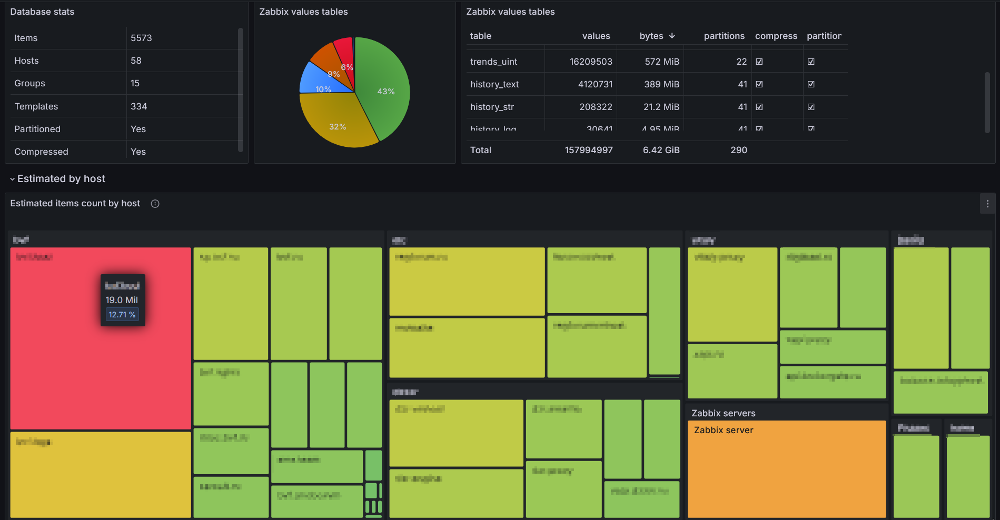

# Zabbix DB Auditor

Zabbix DB Auditor is a collection Grafana dashboards designed to analyze Zabbix database size. This tool provides comprehensive visualizations and insights into your Zabbix database, helping you to optimize storage cost.

This dashboard is also published in the [Grafana dashboard](https://grafana.com/grafana/dashboards/22665-zabbix-db-auditor/) collection.

## Table of Contents

- [Features](#features)
- [Prerequisites](#prerequisites)
- [Database access](#database-access)
- [Dashboard installation](#dashboard-installation)
- [Usage](#usage)
- [Caveats](#caveats)
- [Contributing](#contributing)
- [License](#license)

## Screenshots



## Features

- **Easy-to-evaluate dashboard** - using modern type of visualization [Treemap]( https://grafana.com/grafana/plugins/marcusolsson-treemap-panel/).
- **Quick loading**   - due to approximate analysis of the data planned for the storage.
- **Filters** - filters by host groups and hosts.
- **Accurate counting** - If necessary, it can count the items actually stored in tables.It also counts data from deleted hosts that has not yet been cleared.

## Prerequisites

Before you begin, ensure you have met the following requirements:

- **Grafana**: Ensure you have [Grafana](https://grafana.com/) 10+ installed and running.
- **Treemap Plugin**: for Grafana version **older than 11** you need to install a [Treemap Plugin](https://grafana.com/grafana/plugins/marcusolsson-treemap-panel/). Grafana 11 include this pluging.
- **Zabbix**: Of course, you need Zabbix. Versions 6.0 and 7.0+ are supported.
- **Database Access**: Currently the dashboard only supports MYSQL 8.0+. It is necessary to provide access to the Zabbix database and the ability to `GRANT` rights.


## Database access

The dashboard requires access to the Zabbix database.

in first, create user:
 - make your own password
 - make sure MySQL is not accessible from (container) network

```sql
CREATE USER 'zabbix_db_auditor'@'%' IDENTIFIED BY 'pas_WoRD#!sw';
GRANT USAGE ON zabbix.* TO 'zabbix_db_auditor'@'%';
```

Then execute [grant script](sql/mysql/grant.sql) in zabbix database context.
The table names in the script are short, that is, this script depends on the launch context.

For zabbix version 6, you need execute another grant script [grant-zabbix-6.sql](sql/mysql/grant-zabbix-6.sql) (without `history_bin` table).

It is very important to create limited access to the database.
Often tables in Zabbix contain a lot of access data. But access to data in Grafana is different from what you would expect. You can read more about this in a separate [post in Grafana Blog](https://grafana.com/blog/2024/05/06/data-source-security-in-grafana-best-practices-and-what-to-avoid/) . Carefully granted access eliminates these problems.


## Dashboard Installation

Query sets differ for Zabbix versions and the selected database type.
Therefore, you need to upload to Grafana the corresponding file with the dashboard.
 - [Zabbix 6 and 7 - MySQL](dashboards/mysql/zabbix-db-auditor-mysql.json)
 - Zabbix 7 - Postgresql - **work in progress**

The repository contains an example of setting up [datasource provisioning](provisioning-example/datasources/).
Of couse, dashboards can be provisioned too.

## Recomendations

It is recommended to set up some type of partitioning.
 - For MySQL [Perl script partitioning](https://github.com/OpensourceICTSolutions/zabbix-mysql-partitioning-perl)
 - For Postgresql [TimescaleDB setup](https://www.zabbix.com/documentation/current/en/manual/appendix/install/timescaledb)

The quick estimation  panel works fast enough without these extensions.

## Caveats

- Zabbix items with flexible intervals not fully supported at the estimation dashboard, so it is suggested to calculate the actual items count. These dashboard elements are collapsed by default.

- Although the dashboard allows you to estimate which elements consume the most resources, it is almost impossible to calculate with byte accuracy. Service data, compression and fragmentation affect this.

- Even though this is a Zabbix dashboard, it does not use access via API and a special Zabbix Grafana plugin. You need direct network access to the Zabbix database.

## Contributing

Contributions are welcome and encouraged.

## License

This project is licensed under the GPL-3.0 License. See the [LICENSE](LICENSE) file for more details.
